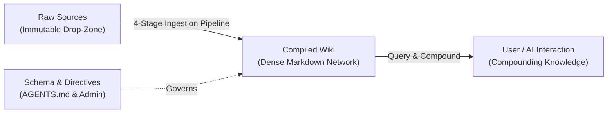

# Karpathy LLM Wiki Pattern

Up: [[admin-index]]

---

## Executive Concept
Instead of retrieving unorganized chunks from raw documents at query time (as in standard RAG), an AI assistant incrementally builds and maintains a **persistent, compounding wiki** — a structured, dense, interlinked network of markdown files.

---

## The 3 Architectural Layers

1. **Layer 1: Raw Sources (`raw/`)**:
   - Curated, untouched, immutable primary documents (PDFs, research papers, technical specs, bookmarks, transcripts).
   - Write-once, read-only.
2. **Layer 2: The Compiled Wiki (`wiki/`)**:
   - High-density, AI-synthesized markdown notes cross-linked with `[[wikilinks]]`.
   - Maintained continuously: updated, refined, and reorganized as new sources arrive.
3. **Layer 3: The Schema & Compiler Rules (`AGENTS.md` & `wiki/admin/`)**:
   - Standard operating directives instructing AI agents on formatting, frontmatter, citation rigor, and conflict handling.

---

## Core Operations

1. **Ingest**:
   - AI reads a primary source from `raw/`.
   - Searches `wiki/` for existing related topics to determine triage disposition (New / Update / Disputed / No Material).
   - Synthesizes or updates dense concept notes following [[karpathy-template]].
   - Registers bidirectional links in domain indices and root [[index]].
   - Appends a single-line transaction record to [[log]].
2. **Query**:
   - Navigate the wiki starting from [[index]] or domain catalogs.
   - Drill into specific concept notes.
   - Syntheses from high-value queries can be crystallized back into the wiki as new permanent notes.
3. **Lint & Maintain**:
   - Periodically audit the wiki for orphan notes, broken links, conflicting claims, or outdated metrics using `scripts/check_evidence.py`.

---

## Related Notes
- [[karpathy-template]]: Specific markdown formatting, frontmatter protocol, and verification rules.
- [[best-practices]]: Guidelines for high-signal synthesis and note lifecycle management.
- [[core-ai-rules]]: Invariants for data preservation and credential safety.
