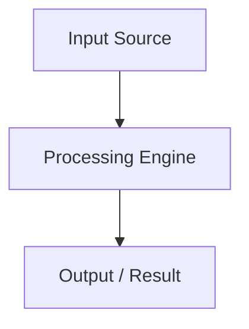

# {Article Title}

> Version: {Version e.g. 2026.03}
> Sources: {Author/Institution, YYYY-MM-DD}
> Raw: [[../../raw/{domain}/{source-file}.md]]
> Updated: {YYYY-MM-DD}

Up: [[{domain}-index]]

---

## Overview
{Dense, factual summary of the core thesis or technical concept. No filler prose or conversational intros.}

## Core Specifications & Architecture
{Structured technical details, parameters, tables, or Mermaid diagrams.}

| Parameter / Field | Type | Description | Constraint / Default |
|---|---|---|---|
| `{field_name}` | `{type}` | {Concise definition} | `{constraints}` |

## Key Invariants & Rules
- **Invariant 1**: {Must hold true under all conditions.}
- **Invariant 2**: {Boundary condition or operational limit.}

{OPTIONAL Status Blocks — place directly under superseded or disputed claims:}

> **Status: Outdated** ({YYYY-MM-DD})  
> {What changed, current understanding, and citation to new source.}

> **Status: Disputed**  
> {Competing claims with explicit citation to respective raw sources.}

---

## Related Notes
- [[{related-concept-1}]]: {Relationship description}
- [[{related-concept-2}]]: {Relationship description}
